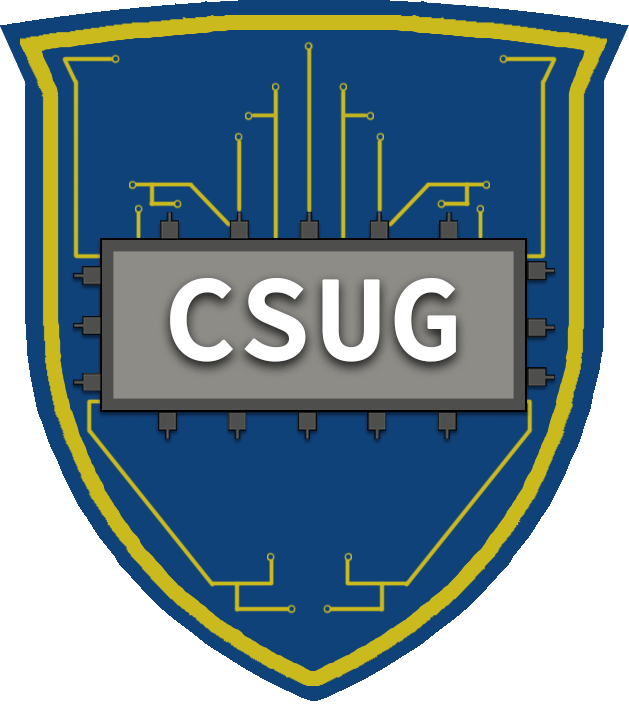

  

    <h1 align="center"> Computer Science Undergraduate Council</h1>

This repository is the implementation and documentation for the official website of Computer Science Undergraduate Council (CSUG) of University of Rochester. The website can be found [here](https://computer-science-undergraduate-council.github.io/official-csug-website/#/)

CSUG is a student-led organization at the University of Rochester, and affiliated with the [Department of Computer Science](https://www.cs.rochester.edu/). The club strives to build a better community of students interested in computer science at the University. As such, CSUG's Github organization along with this repository is built with an intention to provide resources and encourage open source development within the student body :woman_technologist: :man_technologist:

This repository along with the GitHub organization is maintained by the CSUG E-Board :nerd_face:

## Getting Started :wave:

### Requirements :thinking:

1. [Git](https://git-scm.com/downloads)
2. [Node](https://nodejs.org/en/download/) or [Yarn](https://classic.yarnpkg.com/en/docs/install/#mac-stable)

### How to run :smile:

Here we will list some simple steps to get you started with this repo :hugs:

1. Clone the repository to your local computer. You can learn more how to clone a repo [here](https://docs.github.com/en/github/creating-cloning-and-archiving-repositories/cloning-a-repository). This will create a local version in your computer, which is linked with the remote repository on GitHub.

2. Open command prompt or terminal at the folder where the repository has been cloned.

3. Install the dependencies in this project by running `npm install` (if you're using npm) or `yarn` (if you're using yarn)

4. Run the project by typing `npm start` or `yarn start`

5. The website is run locally at `http://localhost:3000/`

## Contributing to the project :sunglasses:

After running the project on your own local computer, you can follow these steps to make your own contributions to the website! :star_struck:

1. Consider forking the repository to your own GitHub, you can find information on how to fork a repo [here](https://docs.github.com/en/github/getting-started-with-github/fork-a-repo#fork-an-example-repository). This will create a copy (actually a fork) in your GitHub for you to work on. If you don't want to fork it, continue with step 2 :point_down:

2. Learn about [the structure of the project](#structure-of-code) and think about where you'd like to make your changes.

3. Create a new branch to start working on the code! You can find information about how to create a new branch [here](https://www.git-tower.com/learn/git/faq/create-branch/)

4. Add the changes you made to your local git by running the command `git add .` (The dot at the end means you want to add all the files)

5. Commit your changes and remember to include a helpful commit message. Example: `git commit -m "Added informative ReadMe.md file"`. More information on committing your changes [here](https://github.com/git-guides/git-commit)

6. Push your code to your remote repository using `git push`. If this fails, then git will automatically give you a suggestion to 'set upstream' with the link to your remote repo. Copy this and type the push command again. More info on pushing to Github is [here](https://github.com/git-guides/git-push)

7. Create a Pull Request on the official repo by following this [guide](https://docs.github.com/en/github/collaborating-with-issues-and-pull-requests/creating-a-pull-request). This helps the admin to review the changes you made to be merged with the official repository. Here, you can compare your changes, add more detailed messages and then submit the Pull Request.

8. Once an organization admin reviews your pull request and approves it, your contribution will be merged :tada: :partying_face:

### Structure of Code :monocle_face:

This website is built using React. The code is broken into smaller Components which can be found in `src/assets/Components`

Each Component uses an [MVC](https://en.wikipedia.org/wiki/Model%E2%80%93view%E2%80%93controller) structure.
This means that each component has three files

1. `index.data.jsx`: This file contains and exports the **data** that will be used by the component. This could be a collection of information or something received from the database. Note: In this project a data file has been added to Components even when not necessary so that we can maintain the structure and allow easy integration in case it's needed in the future.
2. `index.view.jsx`: This file contains and exports the **view** that will be used by the component. This file would include all the positioning and styling of the elements of a component. The data will be passed to this file to be displayed if needed.
3. `index.jsx`: This file is the **controller** and represents the entire component. This file is called by default. This file defines what will be exported by the Component and in what manner. For example, TimeLine and E-board export the data file by default whereas others export the view file by default.
